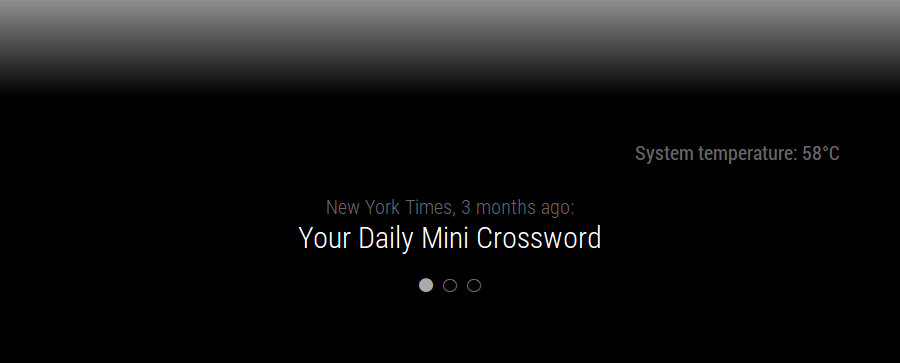

# MMM-page-indicator



This [MagicMirror²][mm] Module is designed indicate what "page" you are looking at. This module is designed to be an indicator only. By itself, it only offers a basic way to change the page, by clicking on the circle indicative of the page you wish to change to.

## Installation

In your terminal, go to your MagicMirror's Module folder:

```bash
cd ~/MagicMirror/modules
```
Clone this repository:
```bash
git clone https://github.com/edward-shen/MMM-page-indicator.git
```
Configure the module in your config.js file.

## Sending notifications to the module

This module responds to the notification `PAGE_CHANGED`. The payload should be an `integer`. Note that this has strict error checking, so `"3"` will not work, while `3` will. Also do note that to switch to page 1, you need to send `0` to the module. **This uses a zero-based numbering system.**

Let's say that you want to change the indicator to page 3. In your code, you would write:
```js
this.sendNotification("PAGE_CHANGED", 2);
```
This would cause the module to change show that you are on page 3.

If you wish to change the number of pages, you need to send a `MAX_PAGES_CHANGED` notification with your payload as an integer.

```js
this.sendNotification("MAX_PAGES_CHANGED", 4);
```

This would now show that there are now 4 pages to display.

You can also just send `PAGE_INCREMENT` or `PAGE_DECREMENT` without any payloads (or with, but it will be ignored) to have the module change the displayed page by one.

## Using the module

To use this module, add it to the modules array in the `config/config.js` file:
```js
modules: [
    {
        module: 'MMM-page-indicator',
        position: 'bottom_bar',
        config: {
            pages: 3,
        }
    }
]
```

## Configuration options

Option|Description
------|-----------
`pages`|Number of pages that you have.<br/>**Expected Value type:** `int`.
`activeBright`|Should the active circle be bright.<br/>**Expected Value type:** `boolean`.
`inactiveDimmed`|Should the inactive circles be dimmed?<br/>**Expected Value type:** `boolean`.
`inactiveHollow`|Should the inactive circles be hollow?<br/>**Expected Value type:** `boolean`.

## FAQ

- Help! My module is (above/below) another module in the same region but I want it to be somewhere else!

  The order of your `config.js` determines your module location. If you have two modules, both with `position:bottom_bar`, the one that is first listed will appear on top. The rest will appear in the same order you defined them in. If you want this module to be at the very bottom, define this module as the last module in your `config.js` file. If you want it to be on top in that region, make sure no other module is defined before it that has the same region.
  
- Can I make a pull request?

  Please do! I'd love for this to be integrated in many modules!
  
- I want more config options!

  Please make an issue. Thanks!

[mm]: https://github.com/MichMich/MagicMirror
